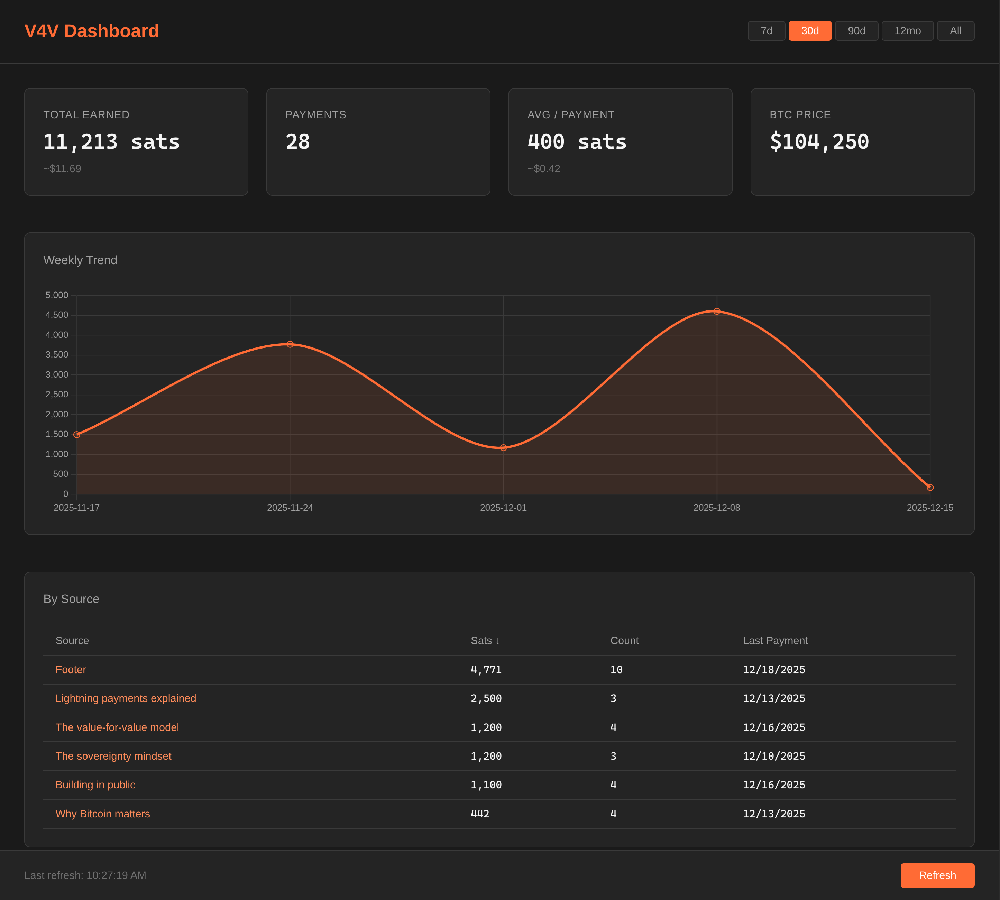

# V4V Analytics


*Dashboard with mock data*

Value for Value payment analytics CLI for Bitcoin Lightning payments via NWC (Nostr Wallet Connect).

> **Note:** This tool requires a Lightning payment proxy that injects page URLs into invoice descriptions. A working implementation is live at shawnyeager.com and will be extracted for general-purpose use.

## Quick Start

```bash
npm install
./bin/v4v init    # Interactive setup wizard
```

Or manually create a `.env` file (see `.env.example`):

```bash
NWC_CONNECTION_STRING=nostr+walletconnect://...
V4V_SITE_URL=yourdomain.com
```

## Commands

### Setup & Status

```bash
./bin/v4v init              # Interactive setup wizard
./bin/v4v status            # Check connection and config status
```

### Reports

```bash
./bin/v4v report                    # Basic payment summary
./bin/v4v report --usd              # Include USD values
./bin/v4v report --by-essay         # Breakdown by essay/page
./bin/v4v report --time-series      # Monthly trend
./bin/v4v report --compare          # Compare to previous period

# Date filtering
./bin/v4v report --since 7d         # Last 7 days (also: 2w, 1m, 3mo, 1y)
./bin/v4v report --from 2024-01-01  # From specific date
./bin/v4v report --from 2024-01-01 --to 2024-01-31

# Output formats
./bin/v4v report --format json      # JSON output
./bin/v4v report --format csv       # CSV to stdout
./bin/v4v report --export data.csv  # CSV to file
```

### Dashboard

```bash
./bin/v4v dashboard                 # Start web dashboard (port 3000)
./bin/v4v dashboard -p 8080         # Custom port
./bin/v4v dashboard --mock          # Use mock data for demos
```

Dashboard features:
- Time range filtering (7d, 30d, 90d, 12mo, All)
- Sortable source table with drill-down
- Weekly trend chart
- Mobile responsive
- URL state persistence (`?range=7&sort=sats`)

### Cache Management

```bash
./bin/v4v cache                     # Show cache stats
./bin/v4v cache --clear             # Clear cache
```

## CLI Options

```bash
./bin/v4v --no-color               # Disable colored output
./bin/v4v --help                   # Show help
./bin/v4v --version                # Show version
```

Colored output respects the `NO_COLOR` environment variable.

## Configuration

| Environment Variable | Description | Default |
|---------------------|-------------|---------|
| `NWC_CONNECTION_STRING` | NWC connection URL (required) | - |
| `V4V_SITE_URL` | Site URL for filtering payments (required) | - |
| `V4V_RSS_URL` | RSS feed URL for essay titles | `https://{site}/feed.xml` |
| `NWC_TIMEOUT` | NWC request timeout in ms | `120000` |
| `V4V_MAX_BATCHES` | Max transaction batches to fetch | `20` |
| `V4V_BATCH_DELAY` | Delay between batches in ms | `300` |

## How It Works

1. Connects to your Alby Hub (or any NWC provider) via Nostr Wallet Connect
2. Fetches incoming Lightning payments with incremental caching
3. Filters for V4V payments (containing your site URL in description)
4. Fetches essay titles from your site's RSS feed for friendly display
5. Aggregates and displays analytics by essay, time period, etc.

## Development

```bash
npm test                   # Run tests
./bin/v4v dashboard --mock # Test dashboard with mock data
```

## License

MIT
